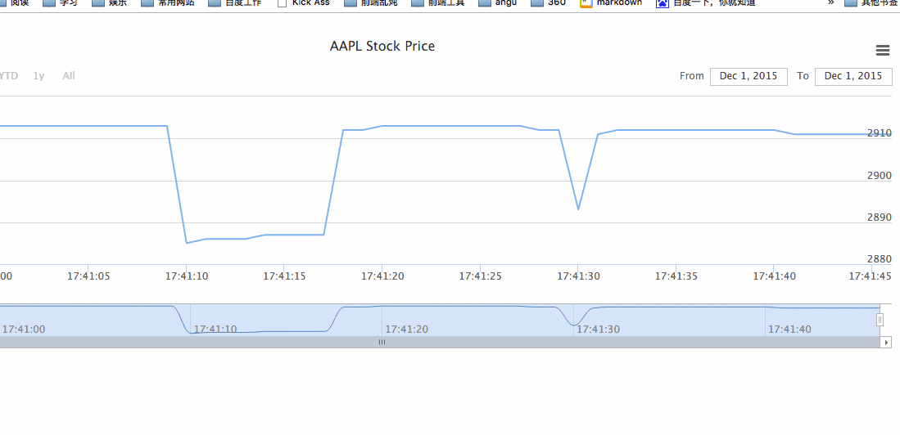

# 简易的内存监控系统

## 视频正在转码，稍后连接奉上

本文的目的在于，尽可能用简单的代码，让大家了解内存监控的原理
主题思路
* 获取内存信息
* 存储信息
* 展现
* 扩展
    - 加主机名,moitor部署在多台机器，不直接插数据库
    - 通过http请求的方式，一台机器起flask专门存数据monitor

## 第一步，我们需要获取内存信息

其实所有的监控项，包括内存数据，都是从文件中读取的，大家执行以下 cat /proc/meminfo就可以看到关于内存的信息，我们关注的是前四行，总内存，空闲内存，缓冲和缓存大小

计算内存占用量公式：
> (总内存-空闲内存-缓冲-缓存)Mb

代码呼之欲出 monitor.py

```python

def getMem():
    f = open('/proc/meminfo')
    total = int(f.readline().split()[1])
    free = int(f.readline().split()[1])
    buffers = int(f.readline().split()[1])
    cache = int(f.readline().split()[1])
    mem_use = total-free-buffers-cache
    print mem_use/1024
while True:
    time.sleep(1)
    getMem()

```

执行文件 python monitor.py，每一秒打印一条内存信息

```
[woniu@teach memory]$ python mointor.py 
2920
2919
2919
2919
2919

```


获取内存数据done!

## 第二部存储数据库

###我们选用mysql 

新建表格,我们需要两个字段，内存和时间 sql呼之欲出

```sql
create memory(memory int,time int)
```

我们的 monitor.py就不能只打印内存信息了，要存储数据库啦,引入mysql模块，代码如下

```python
import time
import MySQLdb as mysql

db = mysql.connect(user="reboot",passwd="reboot123",db="memory",host="localhost")
db.autocommit(True)
cur = db.cursor()

def getMem():
    f = open('/proc/meminfo')
    total = int(f.readline().split()[1])
    free = int(f.readline().split()[1])
    buffers = int(f.readline().split()[1])
    cache = int(f.readline().split()[1])
    mem_use = total-free-buffers-cache
    t = int(time.time())
    sql = 'insert into memory (memory,time) value (%s,%s)'%(mem_use/1024,t)
    cur.execute(sql)
    print mem_use/1024
    #print 'ok'
while True:
    time.sleep(1)
    getMem()

```

多了拼接sql和执行的步骤，具体过程见视频

我们的数据库里数据越来越多，怎么展示呢

我们需要flask
我们看下文件结构

```
.
├── flask_web.py web后端代码
├── mointor.py 监控数据获取
├── static
│   ├── exporting.js
│   ├── highstock.js
│   └── jquery.js
├── templates
│   └── index.html 展示前端页面
└── test.py


```

flask_web就是我们的web服务代码，template下面的html，就是前端展示的文件，static下面是第三方库

flask_web的代码如下

```python
from flask import Flask,render_template,request
import MySQLdb as mysql

con = mysql.connect(user='reboot',passwd='reboot123',host='localhost',db='memory')

con.autocommit(True)
cur = con.cursor()
app = Flask(__name__)
import json

@app.route('/')
def index():
    return render_template('index.html')


@app.route('/data')
def data():
    sql = 'select * from memory'
    cur.execute(sql)
    arr = []
    for i in cur.fetchall():
        arr.append([i[1]*1000,i[0]])
    return json.dumps(arr)


if __name__=='__main__':
    app.run(host='0.0.0.0',port=9092,debug=True)

```
前端index.html

```html
<html>
<head>
<title>51reboot</title>
</head>

<body>
hello world

<div id="container" style="height: 400px; min-width: 310px"></div>

<script src='/static/jquery.js'></script>
<script src='/static/highstock.js'></script>
<script src='/static/exporting.js'></script>
<script>
$(function () {

    $.getJSON('/data', function (data) {

        // Create the chart
        $('#container').highcharts('StockChart', {

            rangeSelector : {
                selected : 1
            },

            title : {
                text : 'AAPL Stock Price'
            },

            series : [{
                name : 'AAPL',
                data : data,
                tooltip: {
                    valueDecimals: 2
                }
            }]
        });
    });

});
</script>

</body>
</html>
```

具体观察数据结构的过程，见视频和[demo链接](http://code.hcharts.cn/highstock/hhhhio)，我们做的 就是把数据库里的数据，拼接成前端画图需要的数据，展现出来

这时候前端就能看到图表啦


我们并不仅限于此，如果想实时的看到内存，应该怎么搞呢

1.查询数据时候增加一个时间戳当限制条件，再次查询时，只返回两次查询之间的增量数据
2.前端动态添加增量结点数据到图表中
3.代码呼之欲出

python
```

tmp_time = 0

@app.route('/data')
def data():
    global tmp_time
    if tmp_time>0:
        sql = 'select * from memory where time>%s' % (tmp_time/1000)
    else:
        sql = 'select * from memory'
    cur.execute(sql)
    arr = []
    for i in cur.fetchall():
        arr.append([i[1]*1000,i[0]])
    if len(arr)>0:
        tmp_time = arr[-1][0]
    return json.dumps(arr)

```

前端,3秒查一次增量数据
```
    $.getJSON('/data', function (data) {

        // Create the chart
        $('#container').highcharts('StockChart', {
        chart:{
        events:{
            load:function(){
                var series = this.series[0]
                setInterval(function(){
                $.getJSON('/data',function(res){
                    $.each(res,function(i,v){
                        series.addPoint(v)
                    })
                })
                },3000)
            }
        }
        },

            rangeSelector : {
                selected : 1
            },

            title : {
                text : 'AAPL Stock Price'
            },

            series : [{
                name : 'AAPL',
                data : data,
                tooltip: {
                    valueDecimals: 2
                }
            }]
        });
    });
```

效果



最终代码（直接下载文件看也行）


监控文件monitor.py
```python
import time
import MySQLdb as mysql

db = mysql.connect(user="reboot",passwd="reboot123",db="memory",host="localhost")
db.autocommit(True)
cur = db.cursor()

def getMem():
    f = open('/proc/meminfo')
    total = int(f.readline().split()[1])
    free = int(f.readline().split()[1])
    buffers = int(f.readline().split()[1])
    cache = int(f.readline().split()[1])
    mem_use = total-free-buffers-cache
    t = int(time.time())
    sql = 'insert into memory (memory,time) value (%s,%s)'%(mem_use/1024,t)
    cur.execute(sql)
    print mem_use/1024
    #print 'ok'
while True:
    time.sleep(1)
    getMem()

```

flask
```python
from flask import Flask,render_template,request
import MySQLdb as mysql

con = mysql.connect(user='reboot',passwd='reboot123',host='localhost',db='memory')
con.autocommit(True)
cur = con.cursor()
app = Flask(__name__)
import json

@app.route('/')
def index():
    return render_template('index.html')

tmp_time = 0

@app.route('/data')
def data():
    global tmp_time
    if tmp_time>0:
        sql = 'select * from memory where time>%s' % (tmp_time/1000)
    else:
        sql = 'select * from memory'
    cur.execute(sql)
    arr = []
    for i in cur.fetchall():
        arr.append([i[1]*1000,i[0]])
    if len(arr)>0:
        tmp_time = arr[-1][0]
    return json.dumps(arr)

if __name__=='__main__':
    app.run(host='0.0.0.0',port=9092,debug=True)
```

前端
```html
<html>
<head>
<title>51reboot</title>
<meta charset='utf-8'>
</head>

<body>
hello world

<div id="container" style="height: 400px; min-width: 310px"></div>

<script src='/static/jquery.js'></script>
<script src='/static/highstock.js'></script>
<script src='/static/exporting.js'></script>
<script>
$(function () {

    $.getJSON('/data', function (data) {

        // Create the chart
        $('#container').highcharts('StockChart', {
        chart:{
        events:{
        
            load:function(){
            
                var series = this.series[0]
                setInterval(function(){
                $.getJSON('/data',function(res){
                    $.each(res,function(i,v){
                        series.addPoint(v)
                    })
                })
                },3000)
            }
        }
        },

            rangeSelector : {
                selected : 1
            },

            title : {
                text : '内存数据'
            },

            series : [{
                name : '本机内存',
                data : data,
                tooltip: {
                    valueDecimals: 2
                }
            }]
        });
    });

});
</script>

</body>
</html>

```


代码没有特别注意细节，希望大家喜欢


